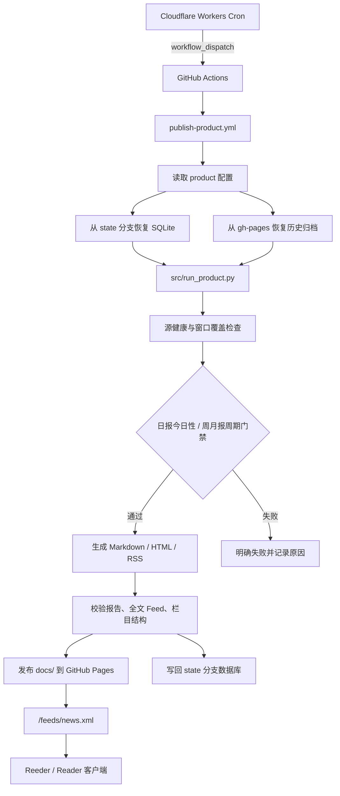

# 观察日报 -- AI 驱动的每日国际新闻长文日报

每天自动生成中文新闻日报，覆盖美国政局、国际局势、科技前沿、经济走势四大维度。多接入方式新闻源并发抓取，AI 评分筛选、事件合并、AI 写作，输出 Markdown + HTML + RSS 全文 Feed，部署在 GitHub Pages，Reader 订阅即读。

## 快速开始

```bash
# 克隆仓库
git clone <repo-url> && cd us_politics_news

# 安装依赖
python3 -m venv venv
source venv/bin/activate
pip install -r requirements.txt

# 配置环境变量
cp .env.example .env
# 编辑 .env，填入 AI_API_KEY（必需）、NEWSAPI_KEY / TIANAPI_KEY（可选）

# 抓取 + 生成 news/daily
python3 src/run_product.py --product news --report-type daily

# 只用数据库已有内容补跑当天日报
python3 src/run_product.py --product news --report-type daily --digest-only
```

生成产物：
- `docs/news/daily/YYYY-MM-DD.md` -- news 产品当日日报（Markdown）
- `docs/news/daily/YYYY-MM-DD.html` -- news 产品当日日报（HTML）
- `docs/feeds/news.xml` -- news 产品 RSS 全文 Feed

兼容别名：
- 若 `config/products/news/product.yaml` 中 `publish.legacy_aliases` 为 `true`，发布流程会同步维护根目录别名，如 `docs/daily/YYYY-MM-DD.html` 与 `docs/feed.xml`

## 部署

主发布链路由 Cloudflare Workers Cron 触发 GitHub Actions：

- 每天北京时间 07:30 触发 `Daily RSS Publish`，抓取并发布日报
- 每周一北京时间 07:35 触发 `Weekly Publish`，基于数据库生成并发布周报
- 每月 1 日北京时间 07:40 触发 `Monthly Publish`，基于数据库生成并发布月报

这些 workflow 会恢复已发布归档、更新产品 feed、重建首页，然后发布到 GitHub Pages。

Reader 订阅地址：

```
https://<username>.github.io/us_politics_news/feeds/news.xml
```

## 发布链路设计



关键设计约束：

- `publish-product.yml` 是统一发布入口；`daily-rss-publish.yml`、`weekly-publish.yml`、`monthly-publish.yml` 只是 thin wrapper，不复制发布逻辑。
- `daily-rss-publish.yml` 必须固定传 `digest_only: false`，不要在 wrapper job 中读取 `inputs.*`。如果需要手动 digest-only 补刊，直接触发 `publish-product.yml` 并传入 `product_key=news`、`report_type=daily`、`digest_only=true`。
- Cloudflare Worker 只负责 dispatch workflow，不直接抓取、生成、写库或发布页面；实际业务流程全部在 GitHub Actions 中执行。
- product 的路径、数据库和 feed 由 `config/products/<product>/product.yaml` 决定。`news` 的正式输出是 `docs/news/...` 和 `docs/feeds/news.xml`，兼容别名 `docs/daily/...` 与 `docs/feed.xml` 只由发布流程同步维护。
- 发布前必须从 `gh-pages` 恢复历史报告和 feed，再生成当期内容；否则新发布会覆盖历史归档或让 Reader 只看到单期内容。
- 状态数据库不放在 `main` 的 `docs/` 里发布。`news` 使用 `news-data` 分支保存 `data/products/news/news.db`，其他 product 使用 `{product}-state` 分支。
- Feed 必须包含 `content:encoded`，并通过 workflow 校验；Reader 订阅依赖 `docs/feeds/news.xml` 的全文 RSS。
- 日报发布契约要求四个栏目都有中文 `重点解析`，不要通过放宽 `format_contract.require_detailed_events` 绕过校验。AI 栏目写作输出为空或未中文化时，应从已评分候选的中文摘要降级生成简版重点解析，仍保留日期和事实边界。
- 周报/月报按时由 workflow 触发，但不是“无论数据质量如何都出刊”。`report_engine` 会在写作前执行 `periodical_gate`：检查窗口内总事件量、硬新闻量、覆盖栏目数、来源层级和源健康；不满足时返回 `periodical_gate_failed`，并把原因写进 metrics，而不是发布结构不完整的周报/月报。
- 源健康不只看 `fetch_log`。由于抓取日志可能为空，健康判断以 `articles` 中的 `source`、`source_tier`、`fetch_mode`、最近出现时间、7/30 天入库量、评分量和栏目分布为主，`fetch_log` 只作为有则使用的辅助信号。
- 周报/月报总览必须是主题线驱动：先聚合周期内事件，再输出跨事件主线、观察点和栏目前置分析。AI 总览失败时，只能从已入选事件标题和正文生成保守 fallback，不得补写输入没有的因果、数字或后续影响。

## Pipeline 流程

```
并发抓取 -> 跨源去重 -> AI 评分 -> 源健康/窗口门禁 -> 事件合并 -> AI 写作 -> 渲染报告 -> 生成 Feed
```

| 步骤 | 说明 |
|------|------|
| 并发抓取 | RSS / RSSHub / Google News / Custom 等抓取器异步并发，统一返回 ContentItem |
| 跨源 URL 去重 | 同一 URL 多源 -> 保留内容最丰富的，合并 metadata |
| AI 评分 | 来源权重 + 主题优先级 + 关键词命中 + AI 深度分析 |
| 源健康/窗口门禁 | 日报检查今日性；周报/月报检查栏目覆盖、硬新闻量、来源层级和单源偏置 |
| 事件合并 | 语义相似度识别同一事件的不同报道 |
| AI 写作 | 生成中文栏目正文、要点与周期性总览 |
| 渲染报告 | Markdown + HTML + Reader 友好 HTML 片段 |
| 生成 Feed | RSS 2.0 全文，Reader 订阅 |

## 周报 / 月报稳定性

周报和月报的目标是“可按时、可解释、可连续”，不是把窗口里的文章简单堆叠成一篇长文。

- 按时：`weekly-publish.yml` 每周一北京时间 07:35 触发，`monthly-publish.yml` 在北京时间月初 07:40 命中后触发，二者都委托 `publish-product.yml` 和 `src/run_product.py`。
- 可解释：运行前会打印数据库健康报告，包括文章总数、窗口内文章数、源覆盖、栏目覆盖和重点源状态。
- 可连续：周/月报优先复用日报沉淀事件；若没有可复用事件，再从数据库窗口内已评分文章构建周期事件。
- 失败优先于坏内容：窗口内数据不满足 `rules.periodical_gate` 时，发布失败并给出原因；不要为了“按时”降低栏目、硬新闻或来源健康门槛。
- 历史回补遵循 7/30 天优先：先补最近 7 天和 30 天缺口，再决定是否扩大到更早历史，不做无边界全量回灌。

## 输出文章结构

### 日报结构

日报最终输出按下面的顺序组织：

```text
今日要点
- 要点 1
- 要点 2
- ...

一、美国政局
### 重点解析
1. 事件标题
   事件单段正文
2. 事件标题
   事件单段正文

### 其他要闻
- 简短补充要闻
- 简短补充要闻

二、国际局势
三、科技前沿
四、经济走势
```

约束：
- 日报顶部不再输出一段总导语，首页和 Reader 都以 `今日要点` 开头
- `重点解析` 只放带单段正文的主事件
- `其他要闻` 只放简短补充条目；如果该栏没有补充条目，就不显示这一小节
- 面向读者的日报输出要求中文可读；明显未翻译的英文标题或英文正文不会进入最终日报

### 周报 / 月报结构

- 周报、月报会保留顶部总览
- 总览结构为：综述段落 + 核心主题列表 + 观察点列表
- 四个栏目仍按 `美国政局 / 国际局势 / 科技前沿 / 经济走势` 顺序展开

## 四大维度

### 美国政局
白宫与行政 · 国会与立法 · 选举与竞选 · 最高法院

### 国际局势
中美关系 · 中东局势 · 俄乌冲突 · 外交政策

### 科技前沿
人工智能 · 半导体与芯片 · 科技公司 · 科技监管

### 经济走势
美联储与货币政策 · 宏观经济 · 贸易与关税 · 金融市场

## 目录结构

```
├── src/
│   ├── __init__.py
│   ├── run_product.py        # 多 product 统一入口（推荐）
│   ├── run_pipeline.py       # news/daily pipeline
│   ├── models.py             # Pydantic 数据模型
│   ├── database.py           # SQLite 存储层
│   ├── fetchers.py           # 异步并发抓取 + 去重
│   ├── scoring.py            # 规则评分 + 推荐理由
│   ├── ai_analyzer.py        # AI 深度分析
│   ├── topic_rules.py        # 主题分类规则
│   ├── report_renderer.py    # 日报渲染（Markdown + HTML）
│   └── feed_builder.py       # RSS Feed 生成
├── config/
│   ├── config.yaml           # 默认指向 news product 的兼容入口
│   ├── base.yaml             # 共享基础配置
│   └── products/news/sources.yaml  # news 产品新闻源配置
├── scripts/
│   ├── daily_run.sh          # 本地定时脚本（旧入口）
│   └── publish_daily.sh      # 仅用数据库补跑日报并可推送
├── docs/
│   ├── news/daily/           # news/daily 输出（运行后生成）
│   ├── feeds/news.xml        # news 产品 Feed（运行后生成）
│   └── ...                   # 兼容别名、weekly/monthly、algorithms 等
├── data/                     # SQLite 数据库 + 历史抓取数据
├── .env.example              # 环境变量模板
└── requirements.txt
```

## 配置说明

### config/config.yaml

兼容入口，默认指向 `news` product。

### config/products/news/product.yaml

news 产品主配置，控制发布路径、定时配置、数据库位置和四栏配额：

- `publish.site_root` -- 站点输出根目录，默认 `docs/news`
- `publish.feed_path` -- feed 输出路径，默认 `docs/feeds/news.xml`
- `publish.legacy_aliases` -- 是否同步维护根目录兼容别名
- `storage.db_path` -- 数据库路径，默认 `data/products/news/news.db`
- `digest.columns` -- 四个栏目各自的主事件/补充要闻配额

### config/base.yaml

基础配置文件，控制共享行为：

- `sources` -- 数据源开关和参数
- `scoring` -- 评分权重和阈值
- `ai` -- AI 写作 provider 和 prompt 配置
- `analysis` -- 历史上下文和分析相关配置
- `runtime` -- 并发和运行时参数

### config/products/news/sources.yaml

news 产品新闻源配置，按四大维度分类，每个源包含：

```yaml
- name: "源名称"
  url: "https://..."
  fetch_mode: rss | rsshub | google_news | custom | hacker_news
  fetcher_key: china_media_article_list   # 仅 custom 必填
  column: us_politics | global_affairs | technology | economy
  source_tier: 1 | 2 | 3 | 4    # 1=官方一线 2=主流 3=专业智库 4=聚合
  language: en | zh | multi
  tags: [cn_source, policy, macro]
  enabled: true | false
```

### .env

环境变量通过 `.env` 文件管理，支持 `${VAR_NAME}` 在 YAML 中引用：

| 变量 | 说明 | 必需 |
|------|------|------|
| `AI_API_KEY` | AI 服务 API Key | 是 |
| `AI_PROVIDER` | openai / deepseek / moonshot 等 | 否（默认 openai） |
| `AI_BASE_URL` | API 端点 | 否（默认 OpenAI） |
| `AI_MODEL` | 模型名称 | 否（默认 gpt-4o-mini） |
| `NEWSAPI_KEY` | NewsAPI 密钥 | 否 |
| `TIANAPI_KEY` | TianAPI 密钥 | 否 |

## 定时运行

```bash
# 本机 cron（每天 8:00 执行，作为本地备用方案）
0 8 * * * /path/to/scripts/daily_run.sh
```

脚本会在运行后自动校验：
- `docs/feeds/news.xml` 包含 `content:encoded`（确保全文 Feed）
- 当日日报文件存在（默认 `docs/news/daily/YYYY-MM-DD.md`）

校验失败会 `exit 1`，便于 CI 告警。

## Cloudflare 定时触发

1. 创建 GitHub fine-grained personal access token，仅授予本仓库 `Actions: write` 权限。不要复用本机 `gh auth` 登录 token。
2. 安装并登录 Wrangler。
3. 将该专用 token 写入 Worker Secret：

```bash
wrangler secret put GITHUB_TOKEN
```

建议补一条校验，确认线上 Worker 已持有独立 secret：

```bash
wrangler secret list
```

4. 部署 Worker：

```bash
wrangler deploy
```

`wrangler.toml` 中的 cron 使用 UTC：

- `30 23 * * *` 等价于北京时间每日 07:30，触发 `daily-rss-publish.yml`
- `35 23 * * 1` 等价于北京时间每周一 07:35，触发 `weekly-publish.yml`
- `40 23 28-31 * *` 在北京时间月初 07:40 命中时触发 `monthly-publish.yml`

Worker 只负责触发 workflow，不直接抓取、生成或发布内容。
