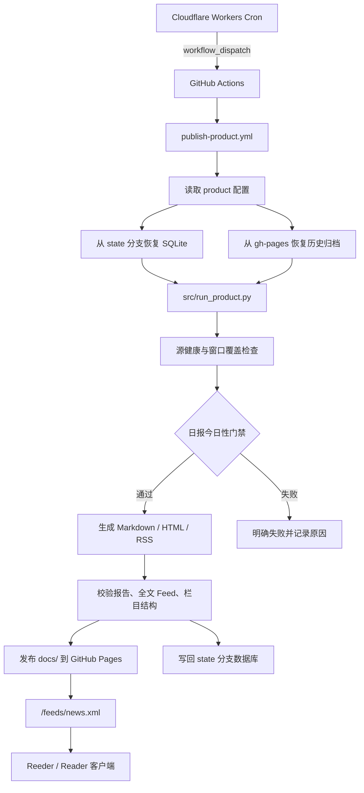

# 观察日报 -- AI 驱动的每日国际新闻长文日报

每天自动生成中文新闻日报，覆盖美国政局、国际局势、科技前沿、经济走势四大维度。多接入方式新闻源并发抓取，AI 评分筛选、事件合并、AI 写作，输出 Markdown + HTML + RSS 全文 Feed，部署在 GitHub Pages，Reader 订阅即读。

## 快速开始

```bash
# 克隆仓库
git clone <repo-url> && cd us_politics_news

# 安装依赖
python3 -m venv venv
source venv/bin/activate
pip install -r requirements.txt

# 配置环境变量
cp .env.example .env
# 编辑 .env，填入 AI_API_KEY（必需）、NEWSAPI_KEY / TIANAPI_KEY（可选）

# 抓取 + 生成 news/daily
python3 src/run_product.py --product news --report-type daily

# 只用数据库已有内容补跑当天日报
python3 src/run_product.py --product news --report-type daily --digest-only
```

生成产物：
- `docs/news/daily/YYYY-MM-DD.md` -- news 产品当日日报（Markdown）
- `docs/news/daily/YYYY-MM-DD.html` -- news 产品当日日报（HTML）
- `docs/feeds/news.xml` -- news 产品 RSS 全文 Feed

兼容别名：
- 若 `config/products/news/product.yaml` 中 `publish.legacy_aliases` 为 `true`，发布流程会同步维护根目录别名，如 `docs/daily/YYYY-MM-DD.html` 与 `docs/feed.xml`

## 部署

主发布链路由 Cloudflare Workers Cron 触发 GitHub Actions：

- 每天北京时间 07:30 触发 `Daily RSS Publish`，抓取并发布日报
- 周报、月报已暂停，不再自动输出

这些 workflow 会恢复已发布归档、更新产品 feed、重建首页，然后发布到 GitHub Pages。

发布作业会启动一个 **RSSHub 服务容器**（`diygod/rsshub`，`localhost:1200`）用于中文源路由抓取，
公共实例 `rsshub.app` 对数据中心 IP 返回 403，因此 CI 内必须自带实例。本地/VPS 自托管方式见
[`deploy/rsshub/README.md`](deploy/rsshub/README.md)。

Reader 订阅地址：

```
https://<username>.github.io/us_politics_news/feeds/news.xml
```

## 发布链路设计


```mermaid
flowchart TD
    CF["Cloudflare Workers Cron"] -->|workflow_dispatch| GH["GitHub Actions"]
    GH --> PP["publish-product.yml"]
    PP --> CFG["读取 product 配置"]
    CFG --> DB["从 state 分支恢复 SQLite"]
    CFG --> PAGES["从 gh-pages 恢复历史归档"]
    DB --> RUN["src/run_product.py"]
    PAGES --> RUN
    RUN --> HEALTH["源健康与窗口覆盖检查"]
    HEALTH --> GATE{"日报今日性门禁"}
    GATE -->|通过| OUT["生成 Markdown / HTML / RSS"]
    GATE -->|失败| FAIL["明确失败并记录原因"]
    OUT --> CHECK["校验报告、全文 Feed、栏目结构"]
    CHECK --> DEPLOY["发布 docs/ 到 GitHub Pages"]
    CHECK --> STATE["写回 state 分支数据库"]
    DEPLOY --> RSS["/feeds/news.xml"]
    RSS --> READER["Reeder / Reader 客户端"]
```

关键设计约束：

- `publish-product.yml` 是统一发布入口；`daily-rss-publish.yml` 是 thin wrapper，不复制发布逻辑。
- `daily-rss-publish.yml` 必须固定传 `digest_only: false`，不要在 wrapper job 中读取 `inputs.*`。如果需要手动 digest-only 补刊，直接触发 `publish-product.yml` 并传入 `product_key=news`、`report_type=daily`、`digest_only=true`。
- Cloudflare Worker 只负责 dispatch workflow，不直接抓取、生成、写库或发布页面；实际业务流程全部在 GitHub Actions 中执行。
- product 的路径、数据库和 feed 由 `config/products/<product>/product.yaml` 决定。`news` 的正式输出是 `docs/news/...` 和 `docs/feeds/news.xml`，兼容别名 `docs/daily/...` 与 `docs/feed.xml` 只由发布流程同步维护。
- 发布前必须从 `gh-pages` 恢复历史报告和 feed，再生成当期内容；否则新发布会覆盖历史归档或让 Reader 只看到单期内容。
- 状态数据库不放在 `main` 的 `docs/` 里发布。`news` 使用 `news-data` 分支保存 `data/products/news/news.db`，其他 product 使用 `{product}-state` 分支。
- Feed 必须包含 `content:encoded`，并通过 workflow 校验；Reader 订阅依赖 `docs/feeds/news.xml` 的全文 RSS。
- 日报发布契约要求四个栏目都有中文 `重点解析`，不要通过放宽 `format_contract.require_detailed_events` 绕过校验。AI 栏目写作输出为空或未中文化时，应从已评分候选的中文摘要降级生成简版重点解析，仍保留日期和事实边界。
- 源健康不只看 `fetch_log`。由于抓取日志可能为空，健康判断以 `articles` 中的 `source`、`source_tier`、`fetch_mode`、最近出现时间、7/30 天入库量、评分量和栏目分布为主，`fetch_log` 只作为有则使用的辅助信号。

## Pipeline 流程

```
并发抓取 -> 跨源去重 -> AI 评分 -> 源健康/窗口门禁 -> 事件合并 -> AI 写作 -> 渲染报告 -> 生成 Feed
```

| 步骤 | 说明 |
|------|------|
| 并发抓取 | RSS / RSSHub / Google News / Custom 等抓取器异步并发，统一返回 ContentItem；custom 源自动抽取发布时间（URL / meta / JSON-LD），正文走 trafilatura（通用）+ GeneralNewsExtractor（中文），超窗旧文直接跳过 |
| 跨源 URL 去重 | 同一 URL 多源 -> 保留内容最丰富的，合并 metadata |
| 例行公告过滤 | 规则识别评论期/听证/拟议预算/费用/FAQ 等例行公告，预筛降权且选择阶段剔除 |
| 预筛与来源配额 | 按来源等级+时效+信息密度排序；单源候选数上限（官方源 2-3 条），避免单一来源霸榜 |
| AI 评分 | 输出 0-100 分 + 新闻价值三维（`newsworthiness` / `routine` / `impact_scope`）；`routine>=0.6` 或 `newsworthiness<0.5` 剔除；主通道失败自动切换备用模型（`AI_FALLBACK_*`） |
| 源健康/窗口门禁 | 日报检查今日性、来源覆盖和窗口健康 |
| 事件合并 | `event_key` + 标题相似度（>=0.85）双路聚类，跨栏目同事件合并为一条 |
| AI 写作 | 生成中文栏目正文、要点与周期性总览 |
| 选择配额 | 单源单栏 <=30% 栏目规模、全报 <=4 条；要点列表同机构 <=2 条 |
| 渲染报告 | Markdown + HTML + Reader 友好 HTML 片段 |
| 生成 Feed | RSS 2.0 全文，Reader 订阅 |

## 输出文章结构

### 日报结构

日报最终输出按下面的顺序组织：

```text
今日要点
- 要点 1
- 要点 2
- ...

一、美国政局
### 重点解析
1. 事件标题
   事件单段正文
2. 事件标题
   事件单段正文

### 其他要闻
- 简短补充要闻
- 简短补充要闻

二、国际局势
三、科技前沿
四、经济走势
```

约束：
- 日报顶部不再输出一段总导语，首页和 Reader 都以 `今日要点` 开头
- `重点解析` 只放带单段正文的主事件
- `其他要闻` 只放简短补充条目；如果该栏没有补充条目，就不显示这一小节
- 面向读者的日报输出要求中文可读；明显未翻译的英文标题或英文正文不会进入最终日报

## 四大维度

### 美国政局
白宫与行政 · 国会与立法 · 选举与竞选 · 最高法院

### 国际局势
中美关系 · 中东局势 · 俄乌冲突 · 外交政策

### 科技前沿
人工智能 · 半导体与芯片 · 科技公司 · 科技监管

### 经济走势
美联储与货币政策 · 宏观经济 · 贸易与关税 · 金融市场

## 目录结构

```
├── src/
│   ├── run_product.py        # 多 product 统一入口（推荐）
│   ├── run_pipeline.py       # news/daily pipeline（抓取→预筛→评分→门禁）
│   ├── content_policy.py     # 例行公告等文本政策规则
│   ├── models.py             # Pydantic 数据模型
│   ├── database.py           # SQLite 存储层
│   ├── fetchers.py           # 异步并发抓取 + 日期抽取 + 去重
│   ├── ai_analyzer.py        # AI 评分 / 事件合并 / 栏目写作
│   ├── report_engine.py      # 报告编排（配额、降级、质量门禁）
│   ├── report_renderer.py    # 日报渲染（Markdown + HTML）
│   └── feed_builder.py       # RSS Feed 生成
├── config/
│   ├── config.yaml           # 默认指向 news product 的兼容入口
│   ├── base.yaml             # 共享基础配置
│   └── products/news/sources.yaml  # news 产品新闻源配置
├── deploy/
│   └── rsshub/               # RSSHub 自托管（docker-compose + 说明）
├── scripts/
│   ├── check_ai_provider.py  # AI 端点预检（CI 第一步）
│   ├── daily_run.sh          # 本地定时脚本（旧入口）
│   └── publish_daily.sh      # 仅用数据库补跑日报并可推送
├── docs/
│   ├── news/daily/           # news/daily 输出（运行后生成）
│   ├── feeds/news.xml        # news 产品 Feed（运行后生成）
│   └── ...                   # 兼容别名、algorithms 等
├── tests/                    # pytest 回归测试
├── data/                     # SQLite 数据库 + 历史抓取数据
├── .env.example              # 环境变量模板
└── requirements.txt
```

## 配置说明

### config/config.yaml

兼容入口，默认指向 `news` product。

### config/products/news/product.yaml

news 产品主配置，控制发布路径、定时配置、数据库位置和四栏配额：

- `publish.site_root` -- 站点输出根目录，默认 `docs/news`
- `publish.feed_path` -- feed 输出路径，默认 `docs/feeds/news.xml`
- `publish.legacy_aliases` -- 是否同步维护根目录兼容别名
- `storage.db_path` -- 数据库路径，默认 `data/products/news/news.db`
- `digest.columns` -- 四个栏目各自的主事件/补充要闻配额

### config/base.yaml

基础配置文件，控制共享行为：

- `sources` -- 数据源开关和参数
- `scoring` -- 评分权重和阈值
- `ai` -- AI 写作 provider 和 prompt 配置
- `analysis` -- 历史上下文和分析相关配置
- `runtime` -- 并发和运行时参数

### config/products/news/sources.yaml

news 产品新闻源配置（当前 158 个源，启用 133 个），按四大维度分类，每个源包含：

```yaml
- name: "源名称"
  url: "https://..."            # 支持 ${RSSHUB_BASE_URL} 变量引用
  fetch_mode: rss | rsshub | google_news | custom | hacker_news
  fetcher_key: china_media_article_list   # 仅 custom 必填
  column: us_politics | global_affairs | technology | economy
  source_tier: 1 | 2 | 3 | 4    # 1=官方一线 2=主流 3=专业智库 4=聚合
  language: en | zh | multi
  max_candidates_per_run: 3     # 可选：单源每次进入候选池的条数上限
  timeout_seconds: 90           # 可选：单源抓取超时（默认 60s）
  tags: [cn_source, policy, macro]
  enabled: true | false
  custom:                        # 仅 custom
    item_patterns: [...]
    article_url_pattern: '20\d{2}-\d{1,2}-\d{1,2}'   # 可选：只保留文章链接，过滤栏目导航
    max_items: 12
    summary_chars: 220
```

中文源（11 个）分两类：

| 类型 | 源 | 说明 |
|------|----|------|
| RSSHub 路由 | FT中文网、联合早报、观察者网、量子位、36氪、华尔街见闻 | 走 `${RSSHUB_BASE_URL}`，CI 用内置 service 容器，本地见 `deploy/rsshub/` |
| 直连解析 | 财新国际×3 | 列表页直连 + `article_url_pattern` 只收带日期的文章链接 |

AI 资讯另有 [AIHOT](https://aihot.news) 精选源（`https://aihot.news/feed/all.xml`，科技栏）。

官方一手源：White House（新闻稿 + 总统行动）、U.S. State Department、Dept of Defense、SCOTUSblog、SEC、Federal Register。

失效源处理（2026-09-16）：Reuters/AP/CNN/Axios 等 13 个官方 RSS 已失效的源标记 `enabled: false`，
改用 Google News `site:` 查询兜底（`Google News - Reuters/AP/CNN/Axios`，tier2，单源 cap 2）。

### .env

环境变量通过 `.env` 文件管理，支持 `${VAR_NAME}` 在 YAML 中引用：

| 变量 | 说明 | 必需 |
|------|------|------|
| `AI_API_KEY` | AI 服务 API Key | 是 |
| `AI_PROVIDER` | openai / deepseek / moonshot 等 | 否（默认 openai） |
| `AI_BASE_URL` | API 端点 | 否（默认 OpenCode Zen Go `https://opencode.ai/zen/go/v1`） |
| `AI_MODEL` | 模型名称 | 否（默认 `deepseek-v4.1-flash`） |
| `AI_FALLBACK_BASE_URL` | 备用通道 API 端点（主通道失败自动切换） | 否 |
| `AI_FALLBACK_MODEL` | 备用模型名称（当前 `glm-5.3-flash`） | 否 |
| `AI_FALLBACK_API_KEY` | 备用通道 Key（留空复用主 Key） | 否 |
| `RSSHUB_BASE_URL` | 自托管 RSSHub 基址（中文源） | 否（默认回退 `https://rsshub.app`；CI 内为 `http://localhost:1200`） |
| `NEWSAPI_KEY` | NewsAPI 密钥 | 否 |
| `TIANAPI_KEY` | TianAPI 密钥 | 否 |

运行前可用 `python3 scripts/check_ai_provider.py` 预检 AI 端点连通性；CI 中该检查是发布流水线的第一步。

健康与质量约束：

- **AI 韧性**：评分/写作调用失败会先切备用通道（记录在日志），仍失败则按 `min_score_coverage` 门禁失败退出，不会静默发劣质日报。
- **源健康**：源连续多日零产出应人工复核；当前零产出源清单与失效源处理见 `reports/2026-09-16-source-and-architecture-review.md`。

## 架构与评审文档

- 运行时架构图（可交互）：[`docs/runtime-architecture.html`](https://zhangex18.github.io/us_politics_news/runtime-architecture.html)
- 信息源与架构深度评审报告：[`reports/2026-09-16-source-and-architecture-review.md`](reports/2026-09-16-source-and-architecture-review.md)

## 定时运行

```bash
# 本机 cron（每天 8:00 执行，作为本地备用方案）
0 8 * * * /path/to/scripts/daily_run.sh
```

脚本会在运行后自动校验：
- `docs/feeds/news.xml` 包含 `content:encoded`（确保全文 Feed）
- 当日日报文件存在（默认 `docs/news/daily/YYYY-MM-DD.md`）

校验失败会 `exit 1`，便于 CI 告警。

## Cloudflare 定时触发

1. 创建 GitHub fine-grained personal access token，仅授予本仓库 `Actions: write` 权限。不要复用本机 `gh auth` 登录 token。
2. 安装并登录 Wrangler。
3. 将该专用 token 写入 Worker Secret：

```bash
wrangler secret put GITHUB_TOKEN
```

建议补一条校验，确认线上 Worker 已持有独立 secret：

```bash
wrangler secret list
```

4. 部署 Worker：

```bash
wrangler deploy
```

`wrangler.toml` 中的 cron 使用 UTC：

- `30 23 * * *` 等价于北京时间每日 07:30，触发 `daily-rss-publish.yml`
Worker 只负责触发 workflow，不直接抓取、生成或发布内容。
